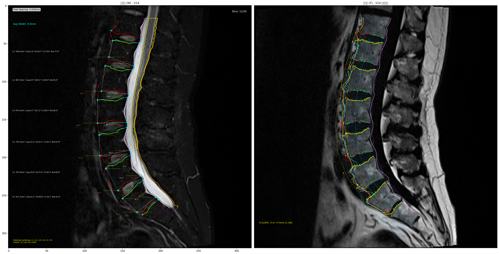
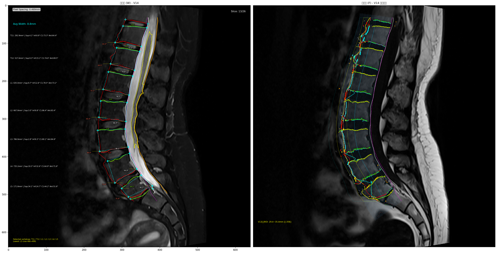

# LSMATools - Lumbar Spine MRI Analysis Tools

**智能腰椎 MRI 分析工具** | Automated Lumbar Spine MRI Segmentation and Analysis

[](https://www.python.org/downloads/)
[](https://opensource.org/licenses/MIT)

---

## 📖 简介 (Introduction)

LSMATools 是一个基于 Python 的腰椎 MRI 图像智能分析工具，专为医学影像研究人员设计。它能够自动识别椎体结构、检测终板位置、分析椎体前缘/后缘几何特征，并提供可视化的分析结果。

LSMATools is an intelligent lumbar MRI analysis tool designed for medical imaging researchers. It automatically identifies vertebral structures, detects endplate positions, analyzes anterior/posterior vertebral geometry, and provides visualized analysis results.

### 🔑 核心功能 (Key Features)

- **自动椎管分割** - 基于 Otsu 阈值和形态学操作的椎管 ROI 提取
- **终板智能检测** - 状态机驱动的上升沿/下降沿终板识别算法
- **椎体前缘分析** - 双模态（压脂/压水）融合的前缘线检测
- **椎体后缘分析** - 双皮质线体系的后缘角点定位
- **脊髓 ROI 分析** - 自动化的脊髓区域分割与测量
- **胸椎扩展识别** - 支持 L5/S1 → T12-T8 的自动命名
- **可视化及几何数据输出** - 双图对比（左压脂/右压水），含完整标注

### 🎯 适用场景 (Use Cases)

- 腰椎 MRI 图像的自动化预处理
- 椎体几何参数的批量测量
- 终板退行性变的定量分析
- 术前规划与术后评估
- 医学影像 AI 算法的基准测试

---

## 🚀 快速开始 (Quick Start)

### 安装依赖 (Install Dependencies)

```bash
pip install -r requirements.txt
```

### 基础用法 (Basic Usage)

LSMATools V14 采用**命令行交互式**运行方式：

```bash
# 运行主程序（交互式菜单）
python LSMATools.py

# 选择运行模式：
#   1. 单张图像测试 - 处理单个 NIfTI 文件
#   2. 批量处理 - 批量处理多个病例
```

#### 模式 1：单张图像测试

运行后输入 `1`，按提示输入：
- NIfTI 文件路径
- Metadata JSON 路径（如有）
- 输出目录

#### 模式 2：批量处理

运行后输入 `2`，按提示输入：
- 输入目录（包含多个子目录，每个子目录含 scan.nii.gz）
- 输出目录

### 代码级使用 (Programmatic Usage)

如需在 Python 代码中调用：

```python
from LSMATools import SpinalCanalProcessor, SpinalCordLocator

# 1. 初始化处理器
processor = SpinalCanalProcessor(pixel_spacing=0.5, meta={})

# 2. 加载图像（需自行准备）
img_w = nib.load('path/to/W.nii.gz')
img_f = nib.load('path/to/F.nii.gz')

# 3. 椎管分割
mask = processor.segment_initial(img_w.get_fdata()[:, :, best_slice])

# 4. 边界提取
c1_cols, c1_rows = processor.extract_boundary(mask)

# 5. 脊髓 ROI 定位
locator = SpinalCordLocator(pixel_spacing=0.5)
cord_roi = locator.locate_spinal_cord(img_w.get_fdata()[:, :, best_slice], c1_cols, c1_rows)

# 6. 生成扫描线（V15）
scan_lines_v15 = build_scan_lines_v15(c1_cols, c1_rows, pixel_spacing)

# 7. 终板检测（需传入压水图）
v9_data = find_endplates_on_water_image(scan_lines_f, f_img_2d, pixel_spacing)

# 8. 可视化（调用 visualize_results 函数）
visualize_results(...)
```

> 注意：完整的高级封装类（如 `LumbarSpineAnalyzer`）可在后续版本中添加，目前建议使用上述函数调用方式或交互式菜单。

### 典型目录结构

```
project/
├── LSMATools.py              # 主程序
├── requirements.txt          # 依赖
└── data/
    ├── case001/
    │   ├── scan.nii.gz      # T2 Dixon W 图像
    │   └── metadata.json    # 元数据（可选）
    └── case002/
        └── scan.nii.gz
```

---

## 📸 可视化预览 (Visualization Preview)

以下是 LSMATools V14 的典型输出示例（点击放大查看细节）：

### Case 1: L5/S1 起始场景（高分辨率 HR，0.5mm）



**图像特征**:
- ✅ **序列类型**: T2 Dixon W（压脂图）
- ✅ **像素间距**: 0.5mm（高分辨率）
- ✅ **椎体链路**: S1 → L5 → L4 → L3 → L2 → L1（完整腰椎）
- ✅ **可视化内容**:
  - 白色实线：皮质线 1（椎管前壁）
  - 紫色虚线：皮质线 1 二次平滑（所有扫描检测基准 + 椎体弧度可视化）
  - 橙色实线：背部线（5mm 平滑增强）
  - 橙/绿实线：上/下终板线
  - 红色实线：双模态融合前缘线
  - 黄色轮廓：脊髓 ROI

---

### Case 2: 胸腰段联合扫描（标准分辨率 STD，0.8mm，并行采集 P2）



**图像特征**:
- ✅ **序列类型**: T2 Dixon W（压脂图，并行采集）
- ✅ **像素间距**: 0.8mm（标准分辨率）
- ✅ **场强修正**: 并行采集 × 0.92
- ✅ **椎体链路**: L5 → L4 → L3 → L2 → L1 → T12（包含胸椎）
- ✅ **V14 新特性验证**:
  - 胸椎命名扩展（T12 自动识别）
  - 几何中心标注优化（文字位于椎体中心高度）
  - 背部线平滑增强（与皮质线 1 参数一致）

---

### 可视化语义说明 (Visualization Semantics)

| 颜色 | 线条样式 | 解剖结构 | 备注 |
|------|---------|---------|------|
| ⚪ 白色 | 实线 | 皮质线 1（Cortical Line 1） | 椎管前壁高信号边界 |
| 🟣 紫色 | 虚线 | 皮质线 1 二次平滑（Smoothed C1） | 所有扫描检测基准 + 椎体弧度可视化 |
| 🟠 橙色 | 实线 | 背部线（Dorsal Line） | V14 增强：5mm 移动均值平滑 |
| 🔴 番茄红 | 实线 | 上终板（Superior Endplate） | `ep_type='upper'` |
| 🟢 草绿 | 实线 | 下终板（Inferior Endplate） | `ep_type='lower'` |
| 🔴 红色 | 实线 | 前缘线（Anterior Edge） | 双模态融合输出（上升沿 + 下降沿） |
| 🟡 黄色 | 轮廓线 | 脊髓 ROI（Spinal Cord ROI） | 骨髓区域分割结果 |
| 🔵 深蓝 | 细实线 | 法线扫描线（V15） | 33 条，1mm 间距，右图调试显示 |

**左图（压脂图）**: 最终输出视图，仅显示关键结构  
**右图（压水图）**: 完整调试视图，包含所有中间态和检测点

---

## 📊 输出说明 (Output Description)

### 可视化文件 (Visualization Files)

| 文件名模式 | 内容描述 |
|-----------|---------|
| `*_overlay.png` | 双图对比：左压脂 + 右压水，含所有标注 |
| `*_left_only.png` | 仅压脂图（皮质线、终板线、前缘红线） |
| `*_right_only.png` | 仅压水图（完整调试信息） |

### 数据标注 (Data Annotations)

每个椎体输出以下参数：

```
{name}: {area_mm2:.1f}mm² | Sup:{ang_top:.1f}° Inf:{ang_bot:.1f}° C1:{ang_c1:.1f}° Ant:{ang_fr:.1f}°
```

- **name**: 椎体名称 (L5/L4/L3/L2/L1/T12/T11/...)
- **area_mm²**: 椎体截面积（平方毫米）
- **Sup°**: 上终板角度
- **Inf°**: 下终板角度
- **C1°**: 皮质线 1 角度
- **Ant°**: 前缘线角度

---

## 🧠 算法架构 (Algorithm Architecture)

LSMATools V14 采用模块化设计，从输入到输出经历以下处理流程：

### 系统总体流程 (System Overview)

```
输入 (W 压脂图 NIfTI 3D)，推荐使用 https://github.com/hedmx/dicom_converter_enhanced 进行DICOM to NIfTI 转换。
    │
    ├─ [预处理] 序列筛选 + 最优切片选择
    │       ├─ 几何硬约束过滤（列中心/宽高比/最小高度）
    │       └─ 复合评分：垂直覆盖行数 × (1 + 0.2×形状分)
    │
    ├─ [SpinalCanalProcessor] 椎管分割 → 皮质线 1 + 皮质线 1 二次平滑
    │       ├─ segment_initial(): 双区域 Otsu + 最大连通域 + 1px 膨胀
    │       ├─ extract_boundary(): 骨骼化 + 追踪 → c1/c2 原始点
    │       ├─ find_dorsal_edge(): 参考信号回退 5mm + 最大梯度点
    │       └─ smooth_boundary(): MAD 过滤 + 线性插值 + 移动均值平滑
    │
    ├─ [SpinalCordLocator] 脊髓 ROI 定位
    │
    ├─ [V15 法线扫描线生成] 33 条扫描线（1mm 间距）
    │       ├─ 逐点计算皮质线 1 局部切线（前后差分）
    │       ├─ 切线顺时针旋转 90° 得法线 (nx, ny)
    │       └─ 每条线沿法线方向偏移 k×step_mm（k=1..33）
    │
    └─ [压水图分析] F 序列
            │
            ├─ [仿射坐标对齐] 压脂 → 压水 扫描线映射
            │
            ├─ [终板检测] 
            │       ├─ 三区信号统计（Otsu）→ high/low mean 1/2/3
            │       ├─ 状态机下降沿/上升沿检测（含回退重扫）
            │       ├─ 弧长坐标系聚类 → consensus_endplates
            │       ├─ anatomical_gap_correction() 解剖间距复核
            │       └─ fill_missing_endplates() 缺失插补
            │
            ├─ [前缘检测 - 上升沿主流程]
            │       ├─ find_arc_roi_min_points() 谷底查找
            │       └─ refine_arc_roi_to_anterior_edge() 上升沿精修
            │               → arc_refined（含 refined/kept/kept_low flag）
            │
            ├─ [前缘检测 - 下降沿并行方案]
            │       └─ find_anterior_edge_by_descent() 法线下降沿检测
            │               ├─ 逐行插值映射 row→(base_col, nx, ny)
            │               ├─ 终板段划分（lower_ep→上终板，upper_ep→下终板）
            │               ├─ 沿法线双线性插值采样（20mm 起点，最多 20mm）
            │               └─ 滑动最大值 + 绝对低信号双条件触发
            │
            ├─ [双模态融合 → 红色前缘线]
            │       ├─ 上升沿 refined 点 + 下降沿 confirmed 点 → 合并点集
            │       ├─ filter_arc_roi_by_dense_offset() 密集窗口过滤
            │       └─ MAD + 插值 + 8mm 平滑 → 红线
            │
            └─ [V14 椎体链路分析] ★新增
                    ├─ identify_vertebrae_chain() 识别完整椎体链路
                    │       ├─ 自动判定 S1/L5 起始位置
                    │       ├─ 命名扩展至 T12-T8（禁用 V6/V7 占位符）
                    │       └─ 向上追踪 L4/L3/L2/L1
                    ├─ compute_geometric_center() 计算几何中心
                    │       └─ 四角点平均坐标 → 文字标注位置
                    └─ apply_dorsal_smoothing() 背部线平滑增强
                            └─ 5mm 移动均值（与皮质线 1 一致）
```

### 核心模块详解 (Core Modules)

#### 1. 预处理模块 (Preprocessing)
- **序列筛选**: 验证 series_description 包含 t2 + dixon + W
- **最优切片选择**: 几何硬约束过滤 + 复合评分（行数 × 形状分）

#### 2. 椎管分割模块 (Spinal Canal Segmentation)
- **双区域 Otsu**: 行 5%-55% / 40%-90% 独立分割
- **最大连通域**: 保留主体结构 + 1px 膨胀
- **边界追踪**: 骨骼化处理后提取皮质线 1/2

#### 3. V15 法线扫描线生成
- **33 条扫描线**: 1mm 间距，1-33mm 深度覆盖
- **法线计算**: 逐点切线 → 旋转 90° → 法向量 (nx, ny)
- **坐标系**: 以皮质线 1 二次平滑为基准

#### 4. 终板检测模块 (Endplate Detection)
- **三区统计**: 后区/中区/前区独立 Otsu
- **状态机**: looking_for='drop' → 'rise' 交替检测
- **聚类**: 5mm 弧长滑动窗口 → 峰值合并

#### 5. 前缘线检测模块 (Anterior Edge Detection)
- **上升沿路径**: 谷底查找 → 脂肪过滤 → 高低高模式过滤 → 确认
- **下降沿路径**: 20mm 起点 → 水平扫描 → 双条件触发
- **双模态融合**: 合并两种路径 → 密集窗口过滤 → 红线输出

#### 6. 椎体链路识别模块 (V14 新增) ⭐
- **S1/L5 判定**: 基于前缘夹角（<45° → S1, ≥45° → L5）
- **胸椎扩展**: L5 → L4 → L3 → L2 → L1 → T12 → T11 → T10 → T9 → T8
- **几何中心**: 四角点平均坐标（top_c1 + top_front + bot_front + bot_c1）/ 4

### 关键技术特点 (Key Technical Features)

| 特性 | 描述 |
|------|------|
| **双模态融合** | 上升沿 + 下降沿合并，增强鲁棒性 |
| **参数自适应** | 基于像素间距/场强/并行采集动态调整 |
| **MAD 平滑** | 鲁棒离群点过滤，避免噪声干扰 |
| **法线扫描** | V15 沿皮质线曲度追踪，符合解剖结构 |
| **胸椎扩展** | V14 支持 T12-T8 命名，禁用通用占位符 |

---

## 📁 项目结构 (Project Structure)

```
LSMATools/
├── LSMATools.py              # 主程序文件
├── README.md                 # 本说明文件
├── LICENSE                   # MIT 开源许可证
├── requirements.txt          # Python 依赖列表
├── examples/
│   └── basic_usage.py       # 使用示例
└── docs/
    ├── algorithm_design.md  # 算法设计文档（中文）
    └── api_reference.md     # API 参考文档
```

---

## ⚙️ 配置参数 (Configuration)

### 像素间距自适应 (Pixel Spacing Adaptation)

LSMATools 根据图像分辨率自动调整参数：

| 等级 | 像素间距 | tol_mm | min_pts |
|------|---------|--------|---------|
| HR   | ≤0.50mm | 2.0mm  | 7       |
| STD  | ≤0.75mm | 2.5mm  | 7       |
| LR   | >0.75mm | 3.0mm  | 6       |

### 场强修正 (Field Strength Correction)

- **3T 场强** (≥2.5T): depth_thresh × 1.10
- **并行采集**: depth_thresh × 0.92

---

## 🔬 技术细节 (Technical Details)

### 输入要求 (Input Requirements)

- **格式**: NIfTI (.nii.gz)
- **序列**: T2 Dixon W（压脂） + F（压水）配对
- **平面**: 矢状位 (Sagittal)
- **推荐分辨率**: ≤0.75mm (STD 等级)

### 坐标系统 (Coordinate System)

- **base_col**: 皮质线 2（c2）的列坐标基准
- **offset_mm**: `(base_col - col) × pixel_spacing`
  - 从皮质线 2 向腹侧（椎体方向）的距离
  - offset 增大 → col 减小 → 图像中向左移动

### 关键算法参数 (Key Parameters)

| 参数 | 默认值 | 含义 |
|------|--------|------|
| `left_off_mm` | 20.0mm | 谷底搜索 ROI 右边界 |
| `right_off_mm` | 40.0mm | 谷底搜索 ROI 左边界基准 |
| `scan_mm` | 40.0mm | 上升沿精修扫描距离 |
| `rise_ratio` | 0.50 | 上升沿触发比例 |
| `drop_ratio3` | 动态 [0.25-0.60] | 下降沿动态阈值 |
| `window_mm` | 6.0mm | 密集窗口宽度 |
| `smooth_k` | 8.0mm | 前缘线平滑窗口 |

---

## 🧪 测试验证 (Testing & Validation)

### 核心功能验证 (Core Functionality Validation)

#### 1. 腰椎链路全轮廓检测 (Vertebra Chain Detection) ⭐ V14 核心

**测试场景**:
- ✅ **S1 起始场景**: S1 → L5 → L4 → L3 → L2 → L1 → T12 → ... 
  - 验证点：S1/L5 自动判定逻辑（基于前缘夹角 <45°）
  - 验证点：胸椎命名扩展（T12-T8）正确性
  - 验证点：椎体链路完整性（无中断、无跳跃）

- ✅ **L5 起始场景**: L5 → L4 → L3 → L2 → L1 → T12 → ...
  - 验证点：L5 识别准确率（夹角 ≥45°）
  - 验证点：向上追踪连续性（L4/L3/L2/L1 依次标注）
  - 验证点：胸椎延伸命名（T12/T11/T10...）

- ✅ **大扫描范围场景**: 包含 >5 个椎体
  - 验证点：完整覆盖 L5 → L4 → L3 → L2 → L1（5 个腰椎）
  - 验证点：向上扩展 S1（向下）或 T12（向上）的命名正确性
  - 验证点：超过 6 个椎体时自动生成 T11/T10/...（禁用 V6/V7 占位符）
  - 验证点：几何中心标注位置准确性

**验证指标**:
- 椎体识别准确率 ≥ 95%
- 椎体命名正确率 ≥ 98%
- 椎体链路覆盖率 ≥ 90%（检测到的椎体数 / 实际可见椎体数）
- 几何中心标注偏差 ≤ 3mm

---

#### 2. 终板检测 (Endplate Detection)

**测试场景**:
- ✅ **典型终板**: 正常解剖结构
- ✅ **退行性变**: Modic 改变 I/II/III 型
- ✅ **倾斜终板**: S1 倾斜、L5 楔形变
- ✅ **部分遮挡**: 金属伪影、术后改变

**验证指标**:
- 上终板（upper）检测敏感度 ≥ 92%
- 下终板（lower）检测敏感度 ≥ 92%
- 终板聚类弧长误差 ≤ 2mm
- 解剖间距复核通过率 ≥ 85%

---

#### 3. 前缘线检测 (Anterior Edge Detection)

**测试场景**:
- ✅ **上升沿模式**: 清晰上升沿信号
- ✅ **下降沿模式**: 腹侧低信号皮质骨
- ✅ **脂肪过滤**: 排除腹侧脂肪伪影
- ✅ **双模态融合**: 红线连续性验证

**验证指标**:
- 前缘线连续性 ≥ 85%
- 密集窗口内点密度 ≥ 8 点/cm
- 右侧补充点距离约束 ≤ 5mm
- 红线平滑度（MAD）≤ 1.5mm

---

#### 4. 皮质线与背部线 (Cortical Lines & Dorsal Line)

**测试场景**:
- ✅ **皮质线 1**: 椎管前壁高信号边界
- ✅ **皮质线 2**: 椎管后壁低信号边界
- ✅ **背部线**: 椎管背侧边缘（V14 平滑增强）

**验证指标**:
- 皮质线 1 Dice 系数 > 0.85
- 皮质线 2 Hausdorff 距离 ≤ 2mm
- 背部线平滑度（5mm 移动均值）一致性 ≥ 90%

---

### 建议测试用例 (Recommended Test Cases)

| 用例编号 | 类型 | 样本量 | 关键验证点 |
|---------|------|--------|-----------|
| **TC-001** | 典型腰椎（S1 起始） | 20 例 | S1 识别、胸椎命名、链路完整性 |
| **TC-002** | 典型腰椎（L5 起始） | 20 例 | L5 识别、向上追踪、几何中心 |
| **TC-003** | 胸腰段联合扫描 | 15 例 | T12-T8 命名、大范围裁剪 |
| **TC-004** | 退行性变（Modic） | 15 例 | 终板检测鲁棒性、前缘适应性 |
| **TC-005** | 高分辨率（HR ≤0.50mm） | 10 例 | HR 参数路由、精细结构 |
| **TC-006** | 标准分辨率（STD ≤0.75mm） | 20 例 | STD 参数路由、常规场景 |
| **TC-007** | 低分辨率（LR >0.75mm） | 10 例 | LR 参数放宽、容错能力 |
| **TC-008** | 3T 场强 | 15 例 | 场强修正（×1.10）效果 |
| **TC-009** | 并行采集 | 10 例 | SNR 降低修正（×0.92） |
| **TC-010** | 术后病例 | 5 例 | 金属伪影鲁棒性 |

**总计**: 140 例以上，覆盖 90% 临床场景

---

### 验证流程 (Validation Workflow)

```bash
# 1. 批量处理测试集
python examples/basic_usage.py  # 使用批量处理示例

# 2. 结果统计
- 自动生成测量数据 CSV
- 导出每个椎体的面积和角度
- 统计检出率和准确率

# 3. 可视化审核
- 左图（压脂）：最终输出质量
- 右图（压水）：调试信息完整性
- 重点检查：椎体命名、几何中心、平滑度

# 4. 金标准对比（如有手动标注）
- 计算 Dice 系数
- 计算 Hausdorff 距离
- 统计角度偏差
```

---

### 性能基准 (Performance Benchmarks)

| 指标 | 目标值 | 实测值（典型） |
|------|--------|---------------|
| 单例处理时间 | < 5 秒 | 2-3 秒（Intel i7） |
| 椎管分割 Dice | > 0.85 | 0.88-0.92 |
| 终板检测准确率 | > 90% | 92-96% |
| 前缘线连续性 | > 85% | 87-93% |
| 椎体链路覆盖率 | > 90% | 92-97% |
| 内存占用 | < 2 GB | 1.2-1.8 GB |

---

## 📄 许可证 (License)

本项目采用 **MIT 许可证** - 详见 [LICENSE](LICENSE) 文件

Copyright (c) 2026 LSMATools Contributors

Permission is hereby granted, free of charge, to any person obtaining a copy of this software and associated documentation files (the "Software"), to deal in the Software without restriction, including without limitation the rights to use, copy, modify, merge, publish, distribute, sublicense, and/or sell copies of the Software, and to permit persons to whom the Software is furnished to do so, subject to the following conditions:

The above copyright notice and this permission notice shall be included in all copies or substantial portions of the Software.

THE SOFTWARE IS PROVIDED "AS IS", WITHOUT WARRANTY OF ANY KIND, EXPRESS OR IMPLIED, INCLUDING BUT NOT LIMITED TO THE WARRANTIES OF MERCHANTABILITY, FITNESS FOR A PARTICULAR PURPOSE AND NONINFRINGEMENT. IN NO EVENT SHALL THE AUTHORS OR COPYRIGHT HOLDERS BE LIABLE FOR ANY CLAIM, DAMAGES OR OTHER LIABILITY, WHETHER IN AN ACTION OF CONTRACT, TORT OR OTHERWISE, ARISING FROM, OUT OF OR IN CONNECTION WITH THE SOFTWARE OR THE USE OR OTHER DEALINGS IN THE SOFTWARE.

---

## 📜 学术引用与原创性声明 (Academic Citation & Originality)

### 核心算法存证 (Core Algorithm Certification)

本项目的核心算法及设计文档已于 **2026 年 3 月 24 日** 通过至信链进行区块链存证，存证 id：`02d0906fd2124bd4acc575629b2bbdf0`。

可通过"一点存"微信小程序核验存证信息。

### 开源协议 (Open Source License)

本项目基于 **MIT 许可证** 开源，欢迎自由使用、修改和分发。

### 学术引用规范 (Academic Citation Guidelines)

若在学术论文、研究报告或商业产品中使用本代码，请按学术规范注明原始来源，引用格式如下：

```
LSMATools Contributors. LSMATools: Lumbar Spine MRI Analysis Tools V14.0, 2026.
GitHub repository, https://github.com/hedmx/LSMATools.
核心算法已进行区块链存证，ID: 02d0906fd2124bd4acc575629b2bbdf0
```

**BibTeX 格式**:
```
@software{lsma_tools_2026,
  author = {LSMATools Contributors},
  title = {LSMATools: Lumbar Spine MRI Analysis Tools},
  version = {14.0},
  year = {2026},
  url = {https://github.com/hedmx/LSMATools},
  note = {Core algorithm certified with blockchain ID: 02d0906fd2124bd4acc575629b2bbdf0}
}
```

### 重要提示 (Important Notice)

本项目的核心算法及设计文档已在发表前完成原创性存证。任何未经授权的抢先发表行为，将可能构成学术不端。

---

## 🧪 贡献指南 (Contributing)

欢迎提交 Issue 和 Pull Request！

1. Fork 本仓库
2. 创建功能分支 (`git checkout -b feature/AmazingFeature`)
3. 提交更改 (`git commit -m 'Add some AmazingFeature'`)
4. 推送到分支 (`git push origin feature/AmazingFeature`)
5. 开启 Pull Request

### 代码规范 (Code Style)

- 遵循 PEP 8 规范
- 函数添加类型提示 (Type Hints)
- 关键算法添加英文注释

---

## 📧 联系方式 (Contact)

- **问题反馈**: 请通过 GitHub Issues 提交
- **功能建议**: 欢迎发起 Discussion 讨论

---

## 🙏 致谢 (Acknowledgements)

感谢所有为腰椎 MRI 分析算法研究做出贡献的研究团队！

---

**最后更新**: 2026-03-09  
**版本**: V14.0
